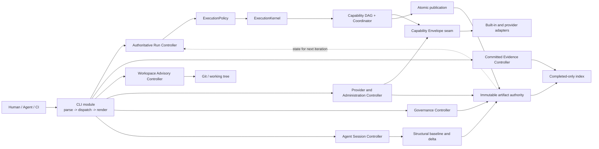

# Code Intel Pipeline architecture convergence plan

Status: proposed implementation plan
Date: 2026-08-02
Scope: converge the existing implementation without dropping committed product behavior

## 1. Decision

Code Intel is a pipeline whose production operation executes one authoritative repository-intelligence iteration. Humans, Agents, CI, provider maintenance, and governance processes form longer-lived loops around that iteration. The architecture must therefore distinguish:

1. a single authoritative iteration kernel;
2. several typed loop controllers with different authority and effects;
3. immutable, snapshot-bound artifacts as the handoff between loops;
4. one CLI interface that invokes those controllers without defining their semantics.

The convergence is an incremental replacement of interfaces, not a rewrite of the tested kernel, schemas, provider adapters, or artifact store.

## 2. Problem being solved

The committed product spine already exists, but its code shape still reflects feature-by-feature delivery:

- `main.rs` dispatches through version handling, a typed primary route, `RAW_ROUTES`, and an older command parser (`crates/code-intel-cli/src/main.rs:209-224`, `553-755`, `832-950`).
- `RAW_ROUTES` mixes stable user operations, internal DAG atoms, provider adapters, read models, governance commands, maintenance operations, and benchmarks.
- many modules expose `run_raw(&[String]) -> i32`, so argument parsing, result rendering, and exit semantics are distributed rather than hidden behind one interface;
- the authoritative `ExecutionPolicy -> ExecutionKernel -> DAG -> publication` path is clearer than the CLI surface around it;
- PowerShell still owns the session-start/session-end structural gate loop, while Rust only adapts optional session evidence;
- the authority difference between committed evidence queries and working-tree advisory analysis is documented in comments but not represented by the top-level command model.

This is architectural debt, not evidence that the promised pipeline functionality is absent.

## 3. Promise lock: behavior that convergence must preserve

| Promise | Existing authority | Preservation rule |
| --- | --- | --- |
| One Primary Operator Entry | `CONTEXT.md:10-14`, `README.md:95-120` | Compiled `code-intel` remains the only default product entry. |
| Rust production spine | `README.md:3`, `README.md:996-1000` | No new PowerShell product behavior; compatibility entries only forward or recover. |
| Stable beta operation | `README.md:122-140` | Stable launch, transactional core reports, fail-closed structural regression, source-free release startup. |
| Snapshot identity | repository snapshot schema and capability envelope | Every provider result, capability result, artifact ref, manifest, resume, and query stays bound to the consumed snapshot. |
| Closed capability contract | `orchestration/schemas/code-intel-capability-envelope.v1.schema.json` | Reuse declaration/request/result/artifact-ref envelopes and their existing status, verdict, effect, and exit-code vocabularies. |
| Policy-owned execution | `execution_policy.rs:23-213` | Provider details do not choose required/optional/disabled semantics or enter the DAG declaration. |
| Provider admissibility | `CONTEXT.md:43-59` and provider-port schemas | Provider success remains Observed Evidence until snapshot, freshness, completeness, provenance, and payload validation admit it. |
| Failure taxonomy | run-state and run-manifest schemas | Preserve domain failure, domain unknown, process failure, dependency blocking, incomplete, and completed as distinct outcomes. |
| Deterministic resume | `dag_coordinator.rs:483-765` | Resume requires matching identities and replays only unfinished nodes. |
| Atomic publication | `run_commit.rs:161-337` | Prevalidate, stage, seal, publish marker last, verify, and roll back on failure. |
| Completed-only reads | `artifact_index.rs:122-351` tests | Staging, forged, legacy, incomplete, and non-completed runs never become latest authoritative evidence. |
| Explicit optional-provider absence | `README.md:133-140` | Missing enhancements remain skipped, manual-required, unavailable, or unknown; never fabricated success. |
| Incremental legacy retirement | `AGENTS.md`, `README.md:3` | Retire a compatibility entry only after Rust parity, contract tests, and release packaging checks pass. |

Schema changes are out of scope unless implementation proves an existing contract cannot express a required committed behavior. Any necessary schema change must be versioned rather than silently widening a closed schema.

## 4. Target architecture



### 4.1 The single authoritative iteration

Retain the authoritative-run deep module:

```rust
authoritative_run::execute(RunRequest) -> Result<ProductionRunResult, RunError>
```

Its private kernel continues to own DAG execution followed by atomic publication (`authoritative_run/execution_kernel.rs`). The private completion seam (`authoritative_run/completion.rs`) validates that handoff and publishes the completed-only index. Do not create a second generic loop engine around it.

### 4.2 Typed loop controllers

Each loop controller is a module with one typed interface. Controllers may reuse internal modules, but they must not share argv parsing or provider-native objects.

| Controller | Reads | Transition | Produces | Authority |
| --- | --- | --- | --- | --- |
| Authoritative Run | repository, prior artifacts, policy | one snapshot-bound Pipeline iteration | run manifest and committed Artifact Refs | authoritative when committed and completed |
| Committed Evidence | completed-only index and verified refs | query, impact, freshness, resume inspection | reproducible read result | authoritative projection of committed evidence |
| Workspace Advisory | Git diff or explicit overlay | risk/edit impact before a run | advisory result | explicitly non-authoritative |
| Provider/Admin | registry, installations, provider observations | list, validate, doctor, repair, rebuild, repin | health or maintenance outcome | administrative; does not create Engineering Facts without admission |
| Governance | committed facts and human authorization | proposal, record, replay, admission decision | durable decision artifacts | authoritative only at the documented approval seam |
| Agent Session | structural baseline plus repository changes | start, check, end | gate result and optional session evidence | gate authority; session evidence remains advisory until admitted |

Do not introduce one configurable `Loop<T>` abstraction. These loops have legitimately different trust models, state, and effects. Their shared seam is typed requests/results plus Artifact Refs, not inheritance or a registry factory.

### 4.3 One CLI interface

The target top-level shape is:

```rust
enum Command {
    Run(RunCommand),
    Read(ReadCommand),
    Workspace(WorkspaceCommand),
    Admin(AdminCommand),
    Governance(GovernanceCommand),
    Session(SessionCommand),
    Internal(InternalCommand),
}

fn parse_command(args: &[OsString]) -> Result<Command, CliError>;
fn execute_command(command: Command, context: &CommandContext)
    -> Result<CommandOutcome, CommandError>;
fn render_outcome(outcome: &CommandOutcome, format: OutputFormat) -> RenderedOutcome;
```

Names are illustrative until Phase 1 locks them through tests. The important constraints are one parser, one dispatcher, one renderer, typed controller inputs, and stable compatibility aliases.

The CLI is an interface to the modules; it is not a separate business layer and does not own Pipeline policy.

## 5. Phase 0 — documentation and contract discovery (completed for planning)

### Findings and allowed existing interfaces

- `ExecutionPolicy::{for_profile, with_mode, with_skips, with_working_tree, with_doctor_overrides}` (`execution_policy.rs:34-150`).
- `authoritative_run::execute(RunRequest)` with its private completion and kernel seams (`authoritative_run.rs`, `authoritative_run/completion.rs`, `authoritative_run/execution_kernel.rs`).
- `DagSpec`, `NodeSpec`, `EdgeSpec`, `Coordinator`, `NodeExecutor`, `Dispatch`, and `NodeOutcome` (`dag_coordinator.rs:395-765`).
- `capability_inventory::execute` behind the capability envelope seam (`capability_inventory.rs:61-114`).
- provider-native `translate_*_native` adapters (`providers.rs:232-262`).
- `run_commit::{publish_existing, commit, recover, validate_committed_run}` (`run_commit.rs:161-337`, `678-690`).
- `artifact_index::{rebuild, incremental, write_index}` (`artifact_index.rs:155-165`, `481+`).
- closed JSON schemas under `orchestration/schemas/` remain the wire authorities.

### Required precondition

Restore a cross-platform green baseline before architecture work becomes gate-enforced. The current Windows failure in `internalization_record` hashes CRLF worktree bytes while the pinned record correctly binds LF Git object bytes. Add a focused cross-platform fixture and make the record verifier bind the intended canonical repository bytes. Do not normalize general artifact payloads or change stored digests as a shortcut.

### Verification

- `cargo test --workspace`
- `legacy/tools/check-hardcoded-paths.ps1`
- focused `internalization_record` test on Windows and a non-Windows runner

## 6. Phase 1 — freeze the command and authority inventory

### What to implement

1. Add a Rust characterization table covering every current `RAW_ROUTES` entry and every legacy `run()` command.
2. For each route record:
   - current spelling and aliases;
   - stability: public, compatibility, or internal;
   - controller ownership;
   - authority: committed, advisory, administrative, or internal;
   - effects vocabulary;
   - JSON/text output schema or fixture;
   - exit-code behavior;
   - compatibility retirement condition.
3. Extend existing help/dispatch tests rather than creating a documentation-only inventory.
4. Add hermetic characterization for the real `session_start -> change -> session_end` exit and JSON behavior before porting it.

### Patterns to copy

- raw-route precedence and offset tests: `main.rs:182-205`;
- help completeness tests: `main.rs:1740-1758`;
- capability closed-schema mutation tests: `capability.rs:977-1012`;
- run outcome/exit mapping: `tests/dag_coordinator.rs`.

### Verification checklist

- every current command is represented exactly once;
- no compatibility spelling changes;
- every command has explicit authority and effect classification;
- session gate fixtures capture both pass and fail exit semantics;
- focused CLI tests and the full workspace suite pass.

### Anti-pattern guards

- do not add another parser or route registry;
- do not classify provider success as authoritative;
- do not assume undocumented session-end exit behavior;
- do not turn the inventory into a second hand-maintained command source.

## 7. Phase 2 — introduce the typed CLI seam without behavior changes

### What to implement

1. Copy the existing typed primary pattern (`PrimaryArgs`, `parse_primary_args`, `run_primary`, `execute_primary`, `primary_result`) into a common typed command flow.
2. Introduce one `Command` model, one parse function, one dispatch function, and one outcome renderer.
3. Wrap existing `run_raw` implementations temporarily with compatibility adapters so command bytes, JSON shape, stderr, and exit codes stay stable.
4. Route version, primary invocation, `RAW_ROUTES`, and legacy `run()` through the new parser in small command-family slices.
5. Make `main.rs` depend only on the typed CLI module; it must no longer import individual provider adapters or artifact operations after the final slice.

### Documentation references

- typed primary pattern: `main.rs:261-435`;
- current route precedence: `main.rs:209-224`, `553-755`;
- stable user-entry promise: `CONTEXT.md:10-14`, `README.md:95-120`.

### Verification checklist

- every ordinary argv case preserves the old revision's exact exit code,
  stdout bytes, and stderr bytes; the fixture applies no normalization;
- default help still emphasizes the Primary Operator Entry and hides internal commands;
- full help covers every compatibility alias under the versioned
  `text-format:help-full.v2` output contract;
- the only accepted behavior change in Phase 2 is `--help --all`: v2 adds
  registered alias discoverability, and the parity fixture records the exact
  old/new bytes, exit code, stderr, reason, and contract identities as one
  intentional delta;
- no fourth dispatch path appears;
- `rg "dispatch_raw_command|fn run\(\)" crates/code-intel-cli/src/main.rs` reaches zero only after all slices migrate.

Exact byte parity and complete alias discoverability are both Phase-2
acceptance requirements. The old `help-full.v1` bytes omitted registered
aliases, so satisfying the completeness requirement necessarily changes those
bytes. Treating that change as an explicit v2 contract delta resolves the
conflict without weakening the parity gate: every other argv/stdout/stderr/exit
observation remains exact, and the delta is not a normalization.

### Anti-pattern guards

- do not expose controller implementation types through the CLI model;
- do not use a dynamic registry/factory where an exhaustive enum match suffices;
- do not change command names and architecture at the same time;
- do not add a CLI framework dependency merely to move the existing complexity.

## 8. Phase 3 — make the authoritative iteration singular

### What to implement

1. Route every production-run spelling to one typed `RunRequest` builder and `authoritative_run::execute`.
2. Keep policy construction centralized through the existing immutable `ExecutionPolicy` methods.
3. Ensure run completion always follows the existing sequence:
   `snapshot -> DAG -> manifest handoff -> publish_existing -> rebuild/incremental index`.
4. Remove any alternate report-generation or publication path that can claim authority without the committed marker and verified Artifact Refs.
5. Preserve old spellings as thin compatibility aliases until release-contract tests permit retirement.

### Patterns to copy

- primary execution: `main.rs:379-424`;
- controller, completion admission, and private-kernel ordering: `authoritative_run.rs`, `authoritative_run/completion.rs`, and `authoritative_run/execution_kernel.rs`;
- DAG construction and policy selection: `dag_run.rs:84-225`;
- end-to-end execute/publish/index/query: `tests/dag_run.rs:191-332`.

### Verification checklist

- all production-run aliases produce equivalent manifests and exit classifications for the same fixture;
- offline/default/strict behavior remains covered by `tests/dag_run.rs:712-872`;
- failed runs may be committed for audit but never replace latest completed;
- a successful run is immediately discoverable by artifact query;
- snapshot mismatch and forged terminal states remain rejected.

### Anti-pattern guards

- do not add loop behavior inside `ExecutionKernel`; it performs one iteration only;
- do not place provider executable names or shell commands in the DAG schema;
- do not bypass A01 request/result envelopes or A03 verified inputs;
- do not create a second artifact authority for convenience.

## 9. Phase 4 — separate committed reads from workspace advisory feedback

### What to implement

1. Add typed request/result interfaces to `evidence_query`, `change_impact`, `edit_impact`, and `change_risk`; retain their CLI serializers as adapters.
2. Put `artifact query`, committed `change impact`, freshness, and resume inspection behind the Committed Evidence Controller.
3. Put `edit impact` and Git-only `change risk` behind the Workspace Advisory Controller.
4. Express authority in the internal result types and existing output contracts; version a wire schema only if the existing schema cannot express it.
5. Make committed reads accept only index entries and reverified Artifact Refs. Make workspace operations accept Git/snapshot inputs without pretending a committed run exists.

### Documentation references

- committed-only query rules: `docs/evidence-query.md:3-13`;
- index rejection tests: `tests/artifact_index.rs:122-351`;
- source comments distinguishing committed and workspace impact: `main.rs:642-666`.

### Verification checklist

- staged, incomplete, forged, and non-completed data cannot enter committed reads;
- workspace commands work before any authoritative run;
- the two command families cannot silently fall back into one another;
- query filtering occurs only after Artifact Ref re-verification;
- query and impact output contracts remain compatible.

### Anti-pattern guards

- do not implement authority as an optional boolean callers can forget;
- do not let workspace results enter the completed-only index;
- do not fold committed and advisory impact into one flag-driven function with changing trust semantics.

## 10. Phase 5 — hide capability atoms and provider-native operations behind their seams

### What to implement

1. Keep `capability_inventory::execute` as the typed adapter seam and the capability envelope as the wire seam.
2. Make DAG execution call typed capability operations without returning through top-level argv parsing.
3. Move direct adapter, snapshot, evidence-validation, file-boundary, runtime-evidence, and run-commit commands into the internal command family.
4. Keep compatibility aliases only where tests, release tooling, or an external caller prove current use.
5. Make provider administration call list/plan/validate/doctor interfaces; provider-native translation stays private to adapters.

### Patterns to copy

- capability validation/execution path: `capability.rs:119-255`;
- typed adapter seam: `capability_inventory.rs:61-114`;
- DAG envelope executor: `dag_run.rs:311-518`;
- provider translators: `providers.rs:232-262`.

### Verification checklist

- DAG behavior no longer depends on CLI argv routing;
- provider process details remain absent from checked-in DAG schemas;
- request/declaration coherence, effect declarations, A03 verification, and closed result schemas still fail closed;
- provider unavailable and provider rejected remain distinguishable;
- integration additions still begin in `orchestration/integrations.json`.

### Anti-pattern guards

- do not create a shared provider database or import provider internals;
- do not let adapters decide Pipeline policy;
- do not treat declared effects as runtime-enforced isolation;
- do not publish raw provider payloads as Engineering Facts.

## 11. Phase 6 — converge administration and governance controllers

### What to implement

1. Move doctor, repair/bootstrap status, artifact index rebuild, repin, compatibility-retirement, and survival scan into a typed Administration Controller.
2. Move decision record/replay, governance admission, and related proposal operations into a typed Governance Controller.
3. Require explicit effect declarations and authorization for mutations; read-only operations return typed outcomes without hidden writes.
4. Preserve decision authority rules: proposals and advisories do not become committed plans without the documented approval seam.
5. Keep recovery launchers outside Pipeline semantics and reduce them to install/locate/verify/forward behavior.

### Documentation references

- Recovery Launcher definition: `CONTEXT.md:10-14`;
- advisory and committed-plan definitions: `CONTEXT.md:112-130`;
- existing provider/admin operations: `providers.rs:794-875`, `1402-1421`, `1539-1554`.

### Verification checklist

- every mutating administration command declares effects and requires explicit invocation;
- read-only doctor/list/plan commands do not mutate repositories;
- decision replay is deterministic and uses verified refs;
- launchers remain thin and produce parity with the compiled CLI;
- no new product behavior appears in `.ps1` files.

### Anti-pattern guards

- do not combine governance authority with provider health;
- do not make a proposal authoritative because it was generated successfully;
- do not add recovery behavior to the iteration kernel.

## 12. Phase 7 — port the Agent Session Controller and thin the PowerShell gate

### What to implement

1. From Phase 1 fixtures, implement typed Rust `SessionStartRequest`, `SessionEndRequest`, and `SessionGateOutcome` with exact parity for baseline persistence, delta calculation, zero-metric fail-closed behavior, JSON, and exit semantics.
2. Reuse the production Rust Sentrux analysis/gate implementation where semantics match; do not shell back into the PowerShell implementation from Rust.
3. Keep optional session evidence adaptation separate from gate authority and snapshot-bind it before DAG consumption.
4. Convert `legacy/Invoke-SentruxAgentTool.ps1 session_start/session_end` into thin forwarding shims only after Rust parity passes on Windows and a non-Windows environment.
5. Re-synchronize all orchestration digest pins once, after every other edit, using literal replacement rather than JSON reserialization.

### Documentation references

- existing PowerShell behavior: `legacy/Invoke-SentruxAgentTool.ps1:362-445`, `506-595`, `3122-3139`;
- Rust session evidence adapter: `session_evidence.rs:46-355`;
- session evidence authority constraints: `docs/session-evidence-adapter.md:47-69`;
- current partial legacy tests: `legacy/scripts/tests/test-regression-fixes.ps1:392-459`.

### Verification checklist

- hermetic start/change/end tests cover pass, regression, stale baseline, zero metrics, missing session, and corrupted state;
- Rust and compatibility shim outputs/exit codes are byte- or schema-equivalent as appropriate;
- session evidence remains advisory until admitted;
- focused Rust tests, legacy compatibility tests, release packaging checks, and hardcoded-path scan pass;
- `session_start` and `session_end` on the repository still enforce structural non-regression.

### Anti-pattern guards

- do not delete the PowerShell implementation before parity and packaging gates pass;
- do not keep two authoritative gate implementations after parity;
- do not fold session evidence into the repository snapshot implicitly;
- do not update pinned JSON by reserializing it.

## 13. Phase 8 — remove obsolete dispatch and retire proven compatibility paths

### What to implement

1. Delete `RawRoute`, `RawRunner`, `RAW_ROUTES`, and the legacy `run()` parser only after all commands are owned by the typed CLI seam.
2. Remove compatibility aliases one at a time according to the Phase 1 retirement conditions.
3. Remove duplicate report/publication paths after their replacement passes existing contract and release tests.
4. Update documentation to show loop controllers and the single-iteration kernel, while leading every command example with compiled `code-intel`.
5. Record retirement evidence and update pinned digests once at the end of the phase.

### Verification checklist

- one parser, one dispatcher, and one renderer remain;
- `main.rs` no longer imports provider-native adapters or individual artifact operations;
- no production module exposes `run_raw(&[String]) -> i32` across the external seam;
- recovery launchers contain no Pipeline semantics;
- every documented command maps to exactly one typed controller;
- release ZIP works without a source tree or Rust toolchain.

### Anti-pattern guards

- no big-bang PowerShell deletion;
- no compatibility flag that preserves two permanent semantic paths;
- no warning-count cleanup campaign;
- no unversioned schema expansion.

## 14. Final verification gate

Run after the last edit of every implementation phase:

1. focused Rust tests for the changed controller and its contracts;
2. relevant integration-contract tests under `crates/code-intel-cli/tests/`;
3. `cargo test --workspace`;
4. compiled `code-intel` self-scan covering run -> publication -> index -> query;
5. legacy compatibility tests for every touched forwarding path;
6. release packaging checks on supported platforms;
7. `legacy/tools/check-hardcoded-paths.ps1`;
8. `legacy/Invoke-SentruxAgentTool.ps1 session_end`;
9. literal digest-pin synchronization after all other edits, followed by the pin contract tests.

No phase is complete merely because the new path works. It is complete only when the old promise is demonstrated through the new interface and any superseded path has either become a thin compatibility adapter or met its explicit retirement condition.

## 15. Recommended execution order and commit boundaries

Execute phases in order. Within each phase, keep commits small enough to preserve a green tree:

1. characterization tests and fixtures;
2. typed request/result interface;
3. one command-family adapter;
4. compatibility parity tests;
5. removal of the superseded internal path;
6. documentation and final pin synchronization.

Do not combine the CLI convergence, authoritative run convergence, and PowerShell session-gate port in one branch. Each is independently reversible until its compatibility contract is proven.
