# Code Intel Pipeline：7 小时工作总结（2026-08-02 至 2026-08-03）

## 结果概览

本轮工作把仓库从“主文件集中调度、运行路径存在重复语义”推进到以 Rust 为主的分层架构：公开 CLI 只负责稳定命令契约，控制器分别承接权威运行、已提交证据和工作区建议，执行策略与 DAG 编排集中管理，所有可消费结果经 Artifact Ref、快照身份和内容摘要验证后进入提交态索引。同时补齐兼容层退役证据、内部化记录和端到端契约测试。

工作树在总结前包含 39 个已跟踪文件变更，约 1,976 行新增、2,546 行删除；主要变化来自拆分 `main.rs`、删除旧 `execution_kernel.rs`、新增控制器与 CLI 分层，以及补强测试和契约文档。

## 完成的工作

1. **收敛 Rust 主入口**
   - 将原本集中在 `main.rs` 的解析、路由和执行职责拆到 `cli`、`authoritative_run`、`committed_evidence_controller`、`workspace_advisory_controller` 等模块。
   - 删除旧的 `execution_kernel.rs` 聚合实现，减少同一运行语义在多个入口重复存在。
   - 新增 CLI 头部契约快照与 parity fixture，保护公开命令、帮助信息和分发优先级。

2. **建立三类控制面**
   - `AuthoritativeRunController`：拥有生产请求、不可变执行策略、DAG 执行、提交态验证和“仅完成态发布”语义。
   - `CommittedEvidenceController`：只消费已经验证和提交的 Artifact Ref，用于查询、变更影响与新鲜度判断。
   - `WorkspaceAdvisoryController`：承接无需权威发布的本地建议型分析，例如 change risk / impact，避免建议结果冒充工程事实。

3. **强化证据与制品权威边界**
   - 加固 artifact index、Artifact Ref 和 committed evidence 的结构、SHA-256、快照身份、路径边界与 UTF-8 契约验证。
   - 明确运行完成态、部分结果和缺失契约的查询语义；索引继续作为可重建视图，而不是独立事实源。
   - 增加 repository iteration provenance schema，使迭代来源成为可验证契约。

4. **统一执行策略与 Provider 行为**
   - 将 CLI 意图归一为一份不可变 `ExecutionPolicy`，由权威运行控制器解释。
   - 明确 strict / optional / offline 三种 Provider 行为：Provider 不可用可以按策略降级，但契约、完整性、内部错误和 I/O 错误不能被伪装成“可选缺席”。
   - Provider 进程保持适配器身份，原生命令细节不进入 Pipeline DAG 契约。

5. **完善确定性分析与治理闭环**
   - 调整改动影响、编辑影响和 change risk 的控制器边界与 Git 采样逻辑，避免目标变更成为自身风险证据。
   - 更新 capability/orchestration 注册校验、内部化记录、schema lifecycle 和最终承诺对账。
   - 继续保留 PowerShell 为兼容入口，只做薄转发和关键修复；退役仍由可验证替代、依赖清零与独立批准共同决定，不做一次性删除。

6. **补齐回归证据**
   - 扩展 `artifact_index`、`dag_run`、`internalization_record`、`primary_entry`、`run_execute_publication` 等测试。
   - 新增 phase-4 authority contract tests 与 CLI head parity 测试，覆盖权威边界、发布条件和公开入口稳定性。
   - 更新执行内核、制品数据契约、提交态索引、运行提交、兼容层退役和 ADR 文档，使实现与文档一致。

## 当前架构

```mermaid
flowchart LR
    U["Human / Agent"] --> E["Primary Operator Entry<br/>code-intel CLI"]
    L["Legacy Recovery Launchers<br/>thin compatibility only"] -. "locate / repair / forward" .-> E

    E --> C["CLI contract and routing"]
    C --> A["Authoritative Run Controller"]
    C --> Q["Committed Evidence Controller"]
    C --> W["Workspace Advisory Controller"]

    A --> P["Immutable Execution Policy<br/>strict / optional / offline"]
    P --> D["Capability DAG / Orchestration"]
    D --> N["Pipeline-owned native capabilities"]
    D --> B["Provider Adapter"]
    X["Independent Evidence Providers<br/>CodeNexus / Repowise / Sentrux / rg"] --> B
    B --> O["Observed Evidence<br/>provenance + snapshot + completeness"]
    N --> V["Contract and integrity validation"]
    O --> V
    V --> R["Typed Artifact Refs<br/>schema + path + SHA-256 + snapshot"]
    R --> K["Committed Artifact Run<br/>content-addressed authority root"]
    K --> I["Rebuildable Artifact Index"]

    I --> Q
    Q --> F["Engineering facts / queries / freshness"]
    W --> G["Advisory risk / impact / edit guidance"]

    M["Capability inventory + method catalog"] --> D
    H["Internalization and schema lifecycle"] --> M
    T["Compatibility retirement gates"] --> L
    K --> T
```

## 架构边界

- **权威事实**只来自通过契约和完整性验证的提交态 Artifact Run。
- **索引**是从权威制品重建的查询视图，不自行创造事实。
- **建议分析**与权威发布分离，可以快速反馈，但不会冒充提交证据。
- **Provider** 通过端口和适配器供给带来源的观察证据，不共享 Pipeline 内部模型或数据库。
- **兼容入口**只负责恢复和转发；Rust CLI 是唯一默认操作入口。
- **退役动作**必须由替代契约、测试、发布打包和独立审批证据驱动。

## 发布范围与本地例外

本次发布包含 Rust 实现、测试、文档、schema、orchestration/internalization 记录以及不含密钥的 Repowise MCP 声明。`.sentrux/agent-sessions/` 是本地会话门禁产物，不进入版本库；`.sentrux/baseline.json` 是否提交以最终门禁产生的仓库状态为准。
